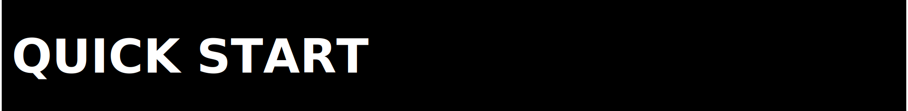

<p>
  
</p>

<p>
  
</p>

This is the shortest honest audit path for the `zpe-video` repo.

It verifies structure and current shipping state of the v0.1.0
perception-receipt surface. It does not by itself establish fitness for a
particular downstream application.

What you can verify quickly:

- the repo installs as a Python package (`pip install -e .[dev]`)
- the package imports cleanly with zero runtime dependencies for the
  core receipt surface
- the full test suite passes (29 tests: 20 receipt + 7 manifest + 2 legacy codec)
- the cross-writer wedge is load-bearing:
  `pytest tests/test_receipt.py::test_cross_writer_independent_implementation_matches`
- the full research transparency bundle is present under
  [`docs/transparency/`](docs/transparency/), including kill verdicts

<p>
  
</p>

1. Create a local environment:

```bash
python3 -m venv .venv
source .venv/bin/activate
python3 -m pip install --upgrade pip
python3 -m pip install -e ".[dev]"
```

2. Run low-cost sanity:

```bash
python3 -m compileall src scripts
python3 -m pytest tests -v
python3 examples/02_cross_writer.py   # expect: "cross-writer wedge: VERIFIED"
python3 - <<'PY'
import zpe_video
print("version:", zpe_video.__version__)
print("public:", sorted(zpe_video.__all__))
PY
```

3. Inspect the current authority routes:

- [`docs/STATUS.md`](docs/STATUS.md) — current shipping state
- [`docs/WEDGE.md`](docs/WEDGE.md) — the defended commercial wedge
- [`docs/TRANSPARENCY_JOURNEY.md`](docs/TRANSPARENCY_JOURNEY.md) — the
  full research history including every kill verdict
- [`docs/transparency/`](docs/transparency/) — reproducible snapshot of
  the evidence behind each verdict

4. Read the limits before making claims:

- [`PUBLIC_AUDIT_LIMITS.md`](PUBLIC_AUDIT_LIMITS.md)
- [`docs/VERIFICATION.md`](docs/VERIFICATION.md)
- [`docs/LEGAL_BOUNDARIES.md`](docs/LEGAL_BOUNDARIES.md)

<p>
  
</p>

Current expected truth:

- package version: `0.1.0`; posture: always-in-beta (useful now, improving continuously)
- one defended commercial wedge: perception-receipt cross-writer hash stability (see [`docs/WEDGE.md`](docs/WEDGE.md))
- full falsification ledger preserved under [`docs/transparency/`](docs/transparency/): archive-query wedge killed, ROI/foveated-sidecar killed, universal video-codec claim killed
- the earlier March-2026 proof subset under `proofs/reference/2026-03-09_workspace_snapshot/` is a historical evidence-custody snapshot from pre-0.1.0 research phases; it is not a current v0.1.0 rerun

What this playbook does not establish on its own:

- fitness for a particular downstream workflow (C2PA, chain-of-custody, video-LLM memory) — those are downstream integration tests
- independent clean-clone benchmark runs (those are separate from this repo-local sanity)
