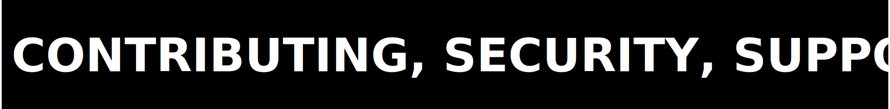

  

# ZPE Video

  

ZPE Video is the live repository for the Zero-Point Encoding video workstream. It packages the current Python code surface, the current proof-custody subset, and the current falsification-led scientific journey for the lane.

The bar here is evidence, not intention. This repository is valuable because it keeps negative results, bounded signals, and retired surfaces visible instead of laundering them into a pass narrative.

<table width="100%" border="1" bordercolor="#b8c0ca" cellpadding="0" cellspacing="0">
  <thead>
    <tr>
      <th align="left">This repo can establish</th>
      <th align="left">This repo cannot establish</th>
    </tr>
  </thead>
  <tbody>
    <tr>
      <td>The current code surface, the current documentation boundary, the current proof snapshot routes, and the latest staged truth from `09.3.2`</td>
      <td>A green commercial wedge, a clean repo-local run-of-record, or a public-release-ready video system</td>
    </tr>
  </tbody>
</table>

  

<table width="100%" cellpadding="0" cellspacing="0">
  <tr>
    <td width="56%" valign="top">
      <pre><code class="language-bash">git clone https://github.com/Zer0pa/ZPE-Video.git
cd ZPE-Video
python3 -m venv .venv
source .venv/bin/activate
python3 -m pip install --upgrade pip
python3 -m pip install -e ".[dev]"
python3 -m compileall src scripts
pytest tests/test_codec.py</code></pre>
      
Current authority bundle: <code>docs/STATUS.md</code>, <code>proofs/PROOF_INDEX.md</code>, and <code>docs/inputs/status-notes/2026-03-23_phase09_3_2_retire_surface/</code>.

    </td>
    <td width="44%" valign="top">
      <table width="100%" border="1" bordercolor="#b8c0ca" cellpadding="0" cellspacing="0">
        <thead>
          <tr>
            <th align="left">Coordinate</th>
            <th align="left">Value</th>
          </tr>
        </thead>
        <tbody>
          <tr><td>Repository URL</td><td><code>https://github.com/Zer0pa/ZPE-Video</code></td></tr>
          <tr><td>Contact</td><td><code>architects@zer0pa.ai</code></td></tr>
          <tr><td>Current staged truth</td><td><code>09.3.2 = retire_surface</code></td></tr>
          <tr><td>Repo posture</td><td><code>staging_only</code></td></tr>
          <tr><td>Package version</td><td><code>0.0.0</code></td></tr>
        </tbody>
      </table>
    </td>
  </tr>
</table>

<table width="100%" border="1" bordercolor="#b8c0ca" cellpadding="0" cellspacing="0">
  <thead>
    <tr>
      <th align="left">Authority route</th>
      <th align="left">What it carries</th>
    </tr>
  </thead>
  <tbody>
    <tr><td><a href="docs/STATUS.md"><code>docs/STATUS.md</code></a></td><td>Current staged truth, current blockers, and exact status semantics</td></tr>
    <tr><td><a href="proofs/PROOF_INDEX.md"><code>proofs/PROOF_INDEX.md</code></a></td><td>Current proof routes and snapshot limits</td></tr>
    <tr><td><a href="docs/inputs/status-notes/2026-03-23_phase09_3_2_retire_surface/"><code>docs/inputs/status-notes/2026-03-23_phase09_3_2_retire_surface/</code></a></td><td>Current status note for the `09.3.2` retirement decision</td></tr>
    <tr><td><a href="proofs/reference/2026-03-09_workspace_snapshot/"><code>proofs/reference/2026-03-09_workspace_snapshot/</code></a></td><td>Historical proof-custody subset copied from the outer workspace</td></tr>
  </tbody>
</table>

  

  

<table width="100%" border="1" bordercolor="#b8c0ca" cellpadding="0" cellspacing="0">
  <thead>
    <tr>
      <th align="left">Workstream slice</th>
      <th align="left">Current status</th>
      <th align="left">Evidence route</th>
    </tr>
  </thead>
  <tbody>
    <tr><td>Broad defended detector surface</td><td><code>not_green</code>; subordinate wedge gate still red</td><td><code>docs/STATUS.md</code></td></tr>
    <tr><td>Sparse VIRAT facility-crossing surface</td><td><code>retire_surface</code> after `09.3.2`</td><td><code>docs/inputs/status-notes/2026-03-23_phase09_3_2_retire_surface/</code></td></tr>
    <tr><td>Portal-local defended result</td><td><code>37.50%</code> suppression at <code>96.30%</code> recall; still below the sovereign gate</td><td><code>docs/STATUS.md</code></td></tr>
    <tr><td>Proof custody surface</td><td><code>mixed_snapshot</code>; historical snapshot plus later partial-touch residue</td><td><code>proofs/PROOF_INDEX.md</code></td></tr>
    <tr><td>Repo-local sanity</td><td><code>import_clean</code>; <code>tests/test_codec.py</code> currently passes</td><td><code>docs/VERIFICATION.md</code></td></tr>
  </tbody>
</table>

<table width="100%" border="1" bordercolor="#b8c0ca" cellpadding="0" cellspacing="0">
  <thead>
    <tr>
      <th align="left">Phase</th>
      <th align="left">Result</th>
      <th align="left">What it established</th>
    </tr>
  </thead>
  <tbody>
    <tr><td><code>09</code></td><td><code>bounded_signal_only</code></td><td>The structural packet is real, but not enough for a defended video wedge on the broad surface.</td></tr>
    <tr><td><code>09.1</code></td><td><code>bounded_signal_only</code></td><td>The factorized continuation still failed to close the wedge honestly.</td></tr>
    <tr><td><code>09.2</code></td><td><code>bounded_signal_only</code></td><td>The layered control-plane continuation still did not clear the governing gate.</td></tr>
    <tr><td><code>09.3</code></td><td><code>bounded_signal_only</code></td><td>A narrow surveillance surface exposed real local signal and real instability.</td></tr>
    <tr><td><code>09.3.1</code></td><td><code>bounded_signal_only</code></td><td>Portal-local simple rules reached <code>34.38%</code> suppression at <code>96.30%</code> recall, but consumer stability remained weak.</td></tr>
    <tr><td><code>09.3.2</code></td><td><code>retire_surface</code></td><td>A bounded portal-local state machine lifted the best defended point to <code>37.50%</code> suppression at <code>96.30%</code> recall and still failed clip-level and LOOCV stability.</td></tr>
    <tr><td><code>09.4</code></td><td><code>in_progress</code></td><td>The live repo is being hardened so the public surface matches the scientific discipline already present in the work.</td></tr>
  </tbody>
</table>

  

<table width="100%" border="1" bordercolor="#b8c0ca" cellpadding="0" cellspacing="0">
  <thead>
    <tr>
      <th align="left">Area</th>
      <th align="left">Purpose</th>
    </tr>
  </thead>
  <tbody>
    <tr><td><a href="README.md"><code>README.md</code></a>, <a href="CHANGELOG.md"><code>CHANGELOG.md</code></a>, <a href="CITATION.cff"><code>CITATION.cff</code></a>, <a href="CODE_OF_CONDUCT.md"><code>CODE_OF_CONDUCT.md</code></a>, <a href="CONTRIBUTING.md"><code>CONTRIBUTING.md</code></a>, <a href="GOVERNANCE.md"><code>GOVERNANCE.md</code></a>, <a href="LICENSE"><code>LICENSE</code></a>, <a href="RELEASING.md"><code>RELEASING.md</code></a>, <a href="ROADMAP.md"><code>ROADMAP.md</code></a>, <a href="SECURITY.md"><code>SECURITY.md</code></a></td><td>Root governance, public boundary, and contribution policy</td></tr>
    <tr><td><a href="src/"><code>src/</code></a>, <a href="scripts/"><code>scripts/</code></a>, <a href="tests/"><code>tests/</code></a></td><td>Live Python package, entry scripts, and lightweight smoke coverage</td></tr>
    <tr><td><a href="docs/"><code>docs/</code></a></td><td>Public documentation surface, status routes, FAQ, support, and repo-shape contract</td></tr>
    <tr><td><a href="proofs/"><code>proofs/</code></a></td><td>Proof routing, historical reference snapshot, rerun targets, and log targets</td></tr>
    <tr><td><a href=".github/"><code>.github/</code></a></td><td>Community intake, PR workflow, and README asset layer</td></tr>
  </tbody>
</table>

<strong>Observability:</strong> <a href="https://www.comet.com/zer0pa/zpe-video/view/new/panels">Comet dashboard</a> (public)

  

  

The commercial question remains open. The current repo does not claim a winning video wedge. What it does show is an ongoing scientific journey that follows the signal from nature toward a viable P8-native consumer by preserving failures, pivots, and bounded wins in public view.

<ul>
  <li>Claims require evidence.</li>
  <li>Negative results are first-class artifacts.</li>
  <li>The latest run-of-record outranks stale summary prose.</li>
  <li>A local lift does not count if the governing acceptance gate stays red.</li>
</ul>

  

<table width="100%" border="1" bordercolor="#b8c0ca" cellpadding="0" cellspacing="0">
  <thead>
    <tr>
      <th align="left">Blocking reality</th>
      <th align="left">Current state</th>
    </tr>
  </thead>
  <tbody>
    <tr><td>Sovereign wedge gate</td><td>Still red; the best defended narrow result remains below the required suppression threshold.</td></tr>
    <tr><td>Clip-level stability</td><td>The defended `09.3.2` result still breaks one clip at <code>5/6</code> recall.</td></tr>
    <tr><td>LOOCV stability</td><td>Holdouts still fail at <code>6/9</code> and <code>2/3</code> recall on the retired surface.</td></tr>
    <tr><td>Proof freshness</td><td>The main proof subset is a historical workspace snapshot, not a fresh repo-local rerun.</td></tr>
    <tr><td>Release posture</td><td><code>staging_only</code>; no public-release claim is justified.</td></tr>
  </tbody>
</table>

  

<table width="100%" cellpadding="0" cellspacing="0">
  <tr>
    <td width="56%" valign="top">
      <ul>
        <li>Contribution workflow: <a href="CONTRIBUTING.md"><code>CONTRIBUTING.md</code></a></li>
        <li>Security policy and reporting: <a href="SECURITY.md"><code>SECURITY.md</code></a></li>
        <li>Support routing: <a href="docs/SUPPORT.md"><code>docs/SUPPORT.md</code></a></li>
        <li>Frequently asked questions: <a href="docs/FAQ.md"><code>docs/FAQ.md</code></a></li>
        <li>Audit route: <a href="AUDITOR_PLAYBOOK.md"><code>AUDITOR_PLAYBOOK.md</code></a></li>
      </ul>
    </td>
    <td width="44%" valign="top">
      <table width="100%" border="1" bordercolor="#b8c0ca" cellpadding="0" cellspacing="0">
        <thead>
          <tr>
            <th align="left">Route</th>
            <th align="left">Target</th>
          </tr>
        </thead>
        <tbody>
          <tr><td>Contributing</td><td><code>CONTRIBUTING.md</code></td></tr>
          <tr><td>Security</td><td><code>SECURITY.md</code></td></tr>
          <tr><td>Support</td><td><code>docs/SUPPORT.md</code></td></tr>
          <tr><td>FAQ</td><td><code>docs/FAQ.md</code></td></tr>
          <tr><td>Audit path</td><td><code>AUDITOR_PLAYBOOK.md</code></td></tr>
        </tbody>
      </table>
    </td>
  </tr>
</table>

  

<table width="100%" border="1" bordercolor="#b8c0ca" cellpadding="0" cellspacing="0">
  <thead>
    <tr>
      <th align="left">Boundary</th>
      <th align="left">Route</th>
    </tr>
  </thead>
  <tbody>
    <tr><td>Legal source of truth</td><td><a href="LICENSE"><code>LICENSE</code></a></td></tr>
    <tr><td>Operational legal summary</td><td><a href="docs/LEGAL_BOUNDARIES.md"><code>docs/LEGAL_BOUNDARIES.md</code></a></td></tr>
    <tr><td>Proof-custody boundary</td><td><a href="PUBLIC_AUDIT_LIMITS.md"><code>PUBLIC_AUDIT_LIMITS.md</code></a> and <a href="proofs/PROOF_INDEX.md"><code>proofs/PROOF_INDEX.md</code></a></td></tr>
  </tbody>
</table>
