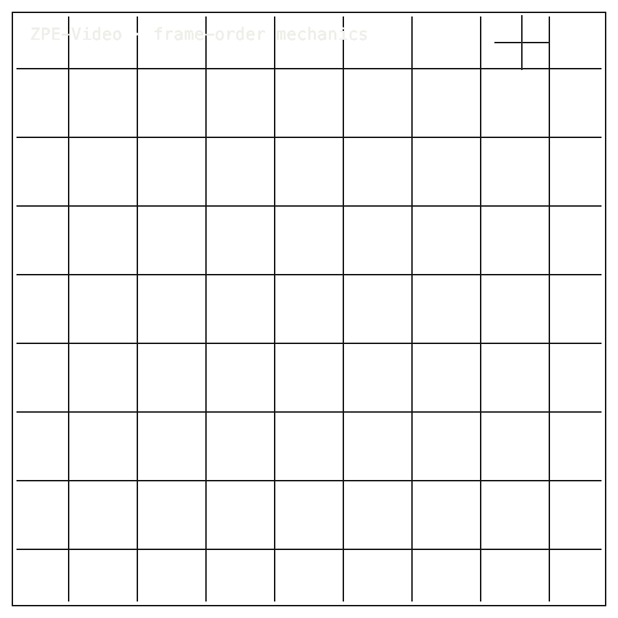

# ZPE-Video

## Install / Developer Commands

#### Quick Start

```bash
git clone https://github.com/Zer0pa/ZPE-Video.git
cd ZPE-Video
python3.11 -m venv .venv
source .venv/bin/activate
python -m pip install --upgrade pip uv
uv sync --extra dev
uv run pytest tests -v
uv run python examples/02_cross_writer.py   # expected: "cross-writer wedge: VERIFIED"
```

Expected: 29/29 tests pass; the cross-writer example prints `cross-writer wedge: VERIFIED` with byte-identical output from the library and an independent from-spec encoder.

---

<table width="100%">
<tr>
<td width="100%" valign="top">
<div><span><b>00 · ZPE-VIDEO</b> · PERCEPTION RECEIPT</span> <span>DEVELOPER-READY · RECEIPT CORE OPEN</span></div>
      <h1>See what AI <span>really saw in video.</span></h1>
      <p>A byte-identical perception receipt for AI video pipelines · ZPE-Video · PyPI <em>zpe-video</em> v0.1.0 · github.com/Zer0pa/ZPE-Video</p>
      <p>AI systems decide what gets flagged in video, who gets identified, what a generation model is trained on — and until now, no one outside the pipeline could check what the detector was actually shown. ZPE-Video is the record that closes that gap. Two independent Python writers, built from the same spec, produce a byte-identical perception receipt for the same frames. <strong>What the AI saw becomes a re-derivable record.</strong> This is not a video codec.</p>
</td>
</tr>
</table>

<table width="100%">
<tr>
<td width="100%" valign="top">
<figure>
        <div></div>
        <figcaption><b>Scope:</b> receipt for detector, tracker, and manifest state. Two writers produce the same bytes; pixels and audio are not reconstructed.</figcaption>
      </figure>
</td>
</tr>
</table>

<table width="100%">
<tr>
<td width="100%" valign="top">
<div><b>01 · THE GAP</b> <span>NO RECEIPT</span></div>
      <h2>An AI processes video — but no one can check what it was actually shown.</h2>
</td>
</tr>
</table>

<table width="100%">
<tr>
<td width="100%" valign="top">
<div><b>02 · MARKETS</b> <span>ADJACENT FORECASTS</span></div>
      <div>
        <div>
          <div><span>AI video market</span>  <span>'33 · $42.3B</span></div>
          <div><span>Content detection / provenance</span>  <span>'30 · $39.7B</span></div>
          <div><span>AI image + video generator</span>  <span>'30 · $60.8B</span></div>
          <div><span>Video analytics</span>  <span>est. $12.4B</span></div>
          <div><span>AI content authentication</span>  <span>est. $3.1B</span></div>
        </div>
      </div>
      <div>Adjacent AI-video and provenance markets · <strong>hypothesis only</strong>; no adoption, compliance, or legal-sufficiency claim.</div>
</td>
</tr>
</table>

<table width="100%">
<tr>
<td width="50%" valign="top">
<div><b>03 · VALUE</b></div>
      <div>$39.7<span>B</span></div>
      <div>Content provenance is growing; ZPE-Video is a bounded Python receipt layer beneath that infrastructure, <b>not a replacement for it</b>.</div>
</td>
<td width="50%" valign="top">
<div><b>04 · INSIGHT</b></div>
      <h2>What AI saw in the video <span>can now be checked.</span></h2>
</td>
</tr>
</table>

<table width="100%">
<tr>
<td width="50%" valign="top">
<div><b>05.1 · CURRENT TECH</b> <span>NO RECEIPT FORMAT</span></div>
        <p>Perception traces from AI video pipelines scatter across Parquet, JSON, pickle, and MCAP containers. There is no portable record format and no second writer that can independently rebuild the same bytes from the spec.</p>
</td>
<td width="50%" valign="top">
<div><b>05.2 · OUR TECH</b> <span>BYTE-IDENTICAL RECEIPT</span></div>
        <p><code>zpe-video</code> <strong>v0.1.0</strong> ships a zero-dependency Python library with a documented wire format, per-frame CRC32, stable receipt hashes, and SHA-256 manifest binding. Two independent writers — one built from the spec by hand — produce <strong>byte-identical</strong> output across <strong>3 receipt-core cases</strong>. The record is re-derivable, not just inspectable.</p>
</td>
</tr>
</table>

<table width="100%">
<tr>
<td width="100%" valign="top">
<div><b>05.3 · BENCHMARKS</b> <span>3 RECEIPT-CORE CASES</span></div>
      <div>
        <div>
          <div><span>Cross-writer SHA</span><b>3</b><small>cases stable</small></div>
          <div><span>Manifest bind</span><b>3</b><small>cases verified</small></div>
          <div><span>Receipt core</span><b>PASS</b><small>not sovereign</small></div>
          <div><span>PyPI</span><b>v0.1.0</b><small>connected</small></div>
        </div>
        <div>
          <div><span>Writer A</span>  <span>SHA=</span></div>
          <div><span>Writer B</span>  <span>SHA=</span></div>
          <div><span>Parquet</span>  <span>MISS</span></div>
        </div>
      </div>
      <div><b>Benchmark:</b> 961B vs Parquet 5,386B · 0.302ms vs 4.500ms · receipt scope only.</div>
</td>
</tr>
</table>

<table width="100%">
<tr>
<td width="34%" valign="top">
<div><b>06 · MEASUREMENT</b> <span>RECEIPT VALIDATION</span></div>
      <h2>Receipt evidence lives in <span>bytes, hash, CRC, and manifest.</span></h2>
</td>
<td width="66%" valign="top">
<div><b>06.1 · COMPARATIVE RECEIPT VALIDATION</b> <span>CROSS-WRITER SHA STABILITY</span></div>
      <div>
        <div>
          <div><span>Writer A</span>  <span>SHA=</span></div>
          <div><span>Writer B</span>  <span>SHA=</span></div>
          <div><span>Parquet</span>  <span>not stable</span></div>
          <div><span>Raw struct</span>  <span>not receipt</span></div>
        </div>
      </div>
      <div>Two writers produce the same bytes on <strong>3 receipt-core cases</strong> · manifest binding holds · Parquet and raw-struct comparators shown for reference · <strong>wider corpus coverage open</strong>. Source: <em>proofs/artifacts/</em></div>
</td>
</tr>
</table>

<table width="100%">
<tr>
<td width="100%" valign="top">
<div><b>07 · KEY METRICS</b> <span>PHASE 09.4 PROVENANCE</span></div>
</td>
</tr>
</table>

<table width="100%">
<tr>
<td width="100%" valign="top">
<div><b>07.1 · CROSS-WRITER SHA</b></div>
      <div>3<span>CASES STABLE</span></div>
      <div>Two independent Python writers · <b>byte-identical output</b></div>
</td>
</tr>
</table>

<table width="100%">
<tr>
<td width="100%" valign="top">
<div><b>07.2 · MANIFEST BIND</b></div>
      <div>3<span>CASES VERIFIED</span></div>
      <div>SHA-256 receipt &rarr; <b>manifest binding verified</b></div>
</td>
</tr>
</table>

<table width="100%">
<tr>
<td width="100%" valign="top">
<div><b>07.3 · RECEIPT CORE</b></div>
      <div>PASS</div>
      <div>Receipt scope only &middot; <b>not full-video replay</b></div>
</td>
</tr>
</table>

<table width="100%">
<tr>
<td width="100%" valign="top">
<div><b>07.4 · RELEASE</b></div>
      <div>v0.1.0</div>
      <div>PyPI <strong>zpe-video</strong> · released 2026-05-04</div>
</td>
</tr>
</table>

<table width="100%">
<tr>
<td width="100%" valign="top">
<div><b>07.5 · COMPRESSION</b></div>
      <div>NO</div>
      <div><strong>No video-frame compression claim.</strong></div>
</td>
</tr>
</table>

<table width="100%">
<tr>
<td width="100%" valign="top">
<div><b>08 · DETERMINISM</b> <span>BYTE-EXACT RECEIPT</span></div>
      <h2>Two independent Python writers, <span>one byte-identical receipt.</span></h2>
</td>
</tr>
</table>

<table width="100%">
<tr>
<td width="66%" valign="top">
<div><b>08.1 · WHAT DETERMINISTIC MEANS</b> <span>RECEIPT SCOPE</span></div>
      <p><strong>Deterministic</strong> means the same detector and tracker input plus the same wire-format spec produce a <em>byte-identical perception receipt</em> from two independent Python writers, with SHA-256 manifest binding verified on the same three receipt-core cases. <strong>Cross-writer SHA-stable</strong> measures the receipt only — it is not deterministic computer vision, deterministic LLM output, a legal evidence chain, full-video replay, or a competitor to AV1 or VVC. The scope is the record, and the scope is named.</p>
</td>
<td width="34%" valign="top">
<div><b>08.2 · HONEST BLOCKER</b></div>
      <span>Honest Blocker ·</span>
      <p>The receipt carries detector and tracker state — boxes, track IDs, timestamps, CRCs, manifest binding. It does not reconstruct pixels, appearance, or audio. Cross-runtime replay is open, C2PA integration is not in scope yet, and the PyPI <strong>v0.1.0 README</strong> still carries stale private-repo and video-codec wording.</p>
</td>
</tr>
</table>

<table width="100%">
<tr>
<td width="33%" valign="top">
<div><b>09</b> </div>
      <h2>WHAT THE MODEL SAW, <span>ON THE RECORD.</span></h2>
</td>
<td width="67%" valign="top">
<div><b>09.1 · THE AMBITION</b></div>
      <p>The ambition is not to compete with video codecs. It is to make the question "what was this AI actually shown?" answerable by anyone who can run Python. When that record exists at intake, AI video systems stop being black boxes that decide on inputs no one else can inspect.</p>
</td>
</tr>
</table>

<table width="100%">
<tr>
<td width="33%" valign="top">
<div><b>09.2 · WHAT WORKS NOW</b></div>
        <h2>Working today: byte-identical perception records, two independent Python writers, manifest-bound on three receipt-core cases.</h2>
</td>
<td width="67%" valign="top">
<div><b>09.3 · WHAT'S STILL OPEN</b></div>
        <h2>Still open: cross-runtime replay, C2PA integration, sovereign closure, and the v0.1.0 PyPI README cleanup.</h2>
</td>
</tr>
</table>

<table width="100%">
<tr>
<td width="100%" valign="top">
<div><b>09.4</b> &middot; MODERATION · NEAR-TERM (12–24 MO)</div>
      <div>Moderation teams gain a re-derivable record</div><div>A trust-and-safety lead reviewing a content-removal appeal can ask the pipeline what frames the detector actually saw, and a second engineer can rebuild the writer and confirm the same bytes. Disputes stop hinging on the platform's word alone.</div>
</td>
</tr>
</table>

<table width="100%">
<tr>
<td width="100%" valign="top">
<div><b>09.5</b> &middot; STORAGE · NEAR-TERM (12–24 MO)</div>
      <div>Detection logs shrink without losing the record</div><div>A surveillance archive owner storing months of detector output keeps the same boxes, tracks, and timestamps at roughly a fifth of the storage footprint of default Parquet. The infrastructure bill drops without changing what the auditor can re-read later.</div>
</td>
</tr>
</table>

<table width="100%">
<tr>
<td width="100%" valign="top">
<div><b>09.6</b> &middot; PROVENANCE · MID-TERM (24–48 MO)</div>
      <div>Provenance standards get a perception layer</div><div>Content-authentication standards like C2PA describe what was made; this describes what was seen on the way in. As both layers connect, a published video can be traced back to the exact detector inputs the producing pipeline acknowledged, not just the rendered output.</div>
</td>
</tr>
</table>

<table width="100%">
<tr>
<td width="100%" valign="top">
<div><b>09.7</b> &middot; INTEGRITY · MID-TERM (24–48 MO)</div>
      <div>Silent corruption stops reaching the model</div><div>A video-LLM inference pipeline that accepts a corrupted detector record today produces a quietly wrong answer. With per-frame CRC checked on decode, corruption surfaces as a raised error at the gate, so a downstream operator notices before the bad inference reaches a user.</div>
</td>
</tr>
</table>

<table width="100%">
<tr>
<td width="100%" valign="top">
<div><b>09.8</b> &middot; GOVERNANCE · PARADIGM (48 MO+)</div>
      <div>AI video input becomes legally answerable</div><div>Regulators, insurers, and courts asking what an AI was shown today get a shrug. When pipelines carry byte-identical perception records at intake, the question becomes answerable on demand, and AI-video liability shifts from speculation about model intent to inspection of recorded input.</div>
</td>
</tr>
</table>
